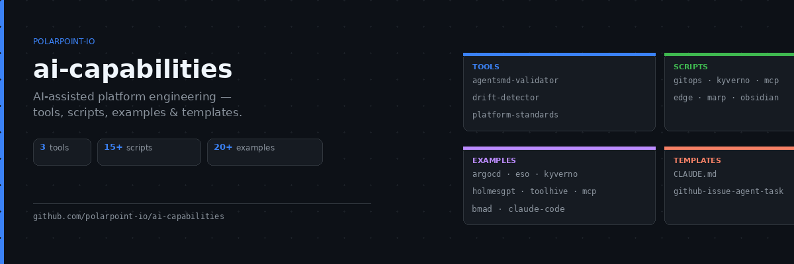

# AI Capabilities



Companion repository for the [Polarpoint blog](https://www.polarpoint.io/blog/) series on AI-assisted platform engineering.

This repo contains:
- Installable CLI tools for managing AI agents at scale
- Platform standards templates and schema
- Example `AGENTS.md` patterns for platform workflows
- Sample scripts to collect metrics and generate outputs
- Walkthrough examples you can run locally

---

## Tools

### [`agentsmd-validator`](./agentsmd-validator) · [](https://www.npmjs.com/package/@polarpoint/agentsmd-validator)

Zero-dependency Node.js CLI that validates zone-structured `AGENTS.md` files against a schema. Checks zone markers, required sections, executable commands in test instructions, and Zone 1 drift.

```bash
npx @polarpoint/agentsmd-validator --file AGENTS.md
npx @polarpoint/agentsmd-validator \
  --file AGENTS.md \
  --schema https://raw.githubusercontent.com/your-org/platform-standards/main/schema.json
```

### [`drift-detector`](./drift-detector)

Pure-stdlib Python script that scans a GitHub org and reports which repos have Zone 1 content that has drifted from the platform standard.

```bash
python drift-detector/detect-drift.py \
  --org your-org \
  --token $GITHUB_TOKEN \
  --schema https://raw.githubusercontent.com/your-org/platform-standards/main/schema.json
```

### [`platform-standards`](./platform-standards)

Default three-zone `AGENTS.md` template and `schema.json` for use as the source of truth in your platform-standards repo.

---

## Templates

| Template | What it covers |
|----------|---------------|
| `templates/CLAUDE.md` | AGENTS.md routing map with Tier 1/2/3 approval model and platform engineering extensions to Karpathy's CLAUDE.md rules |
| `templates/github-issue-agent-task.md` | Structured GitHub issue template for agent task delegation |

---

## Examples

| Example | What it covers | Blog post |
|---------|---------------|-----------|
| `platform-release-checklist.md` | Safe, gate-based platform releases | [AGENTS.md for Platform Engineering](https://www.polarpoint.io/blog/2026/03/24/using-agentsmd-for-platform-engineering/) |
| `incident-runbook.md` | Standardised incident response | [AI Incident Triage](https://www.polarpoint.io/blog/2026/04/09/ai-incident-triage-faster-summaries-safer-actions/) |
| `incident-triage.md` | AI-assisted incident context gathering | [AI Incident Triage](https://www.polarpoint.io/blog/2026/04/09/ai-incident-triage-faster-summaries-safer-actions/) |
| `infra-bootstrap.md` | New environment bootstrap workflow | [AGENTS.md for Platform Engineering](https://www.polarpoint.io/blog/2026/03/24/using-agentsmd-for-platform-engineering/) |
| `slo-review.md` | Monthly SLO review automation | [SLO-Driven Automation](https://www.polarpoint.io/blog/2026/04/09/slo-driven-automation-closing-the-loop-from-alerts-to-fixes/) |
| `sprint-review-deck.md` | Marp deck generation from metrics | [Sprint Reviews with Marp](https://www.polarpoint.io/blog/2026/03/29/sprint-reviews-with-marp-presentations-as-code/) |
| `drift-detection.md` | GitOps drift classification and fix PRs | [GitOps + AI Drift Detection](https://www.polarpoint.io/blog/2026/04/07/gitops-ai-drift-detection-catch-it-before-prod/) |
| `cost-monitoring.md` | Cloud cost anomaly detection and fix PRs | [AI for FinOps](https://www.polarpoint.io/blog/2026/04/10/ai-for-finops-cost-drift-detection-and-fix-prs/) |
| `policy-gate.md` | OPA/Kyverno validation for agent changes | [Policy as Code + Agents](https://www.polarpoint.io/blog/2026/04/08/policy-as-code-agents-guardrails-that-actually-hold/) |
| `dora-metrics.md` | DORA metrics collection and reporting | [DevEx Metrics That Matter](https://www.polarpoint.io/blog/2026/04/07/devex-metrics-that-matter-and-how-to-automate-them/) |
| `obsidian-vault-processor.md` | Process an Obsidian PARA vault inbox with Claude | [Your Second Brain, Now With an AI Inside It](https://www.polarpoint.io/blog/2026/05/04/your-second-brain-now-with-an-ai-inside-it/) |
| `mcp-production.md` | MCP gateway: auth, rate limiting, audit logging, injection detection | [MCP in the Real World](https://www.polarpoint.io/blog/2026/04/07/mcp-in-the-real-world-security-permissions-and-operations/) |
| `holmesgpt-backstage-mcp.md` | HolmesGPT + Backstage Catalog & Scaffolder via TeraSky MCP plugins — service ownership context and time-bound access provisioning | [From Alert to Root Cause: HolmesGPT in Production](https://www.polarpoint.io/blog/2026/04/07/holmesgpt-incident-triage/) |
| `toolhive-operator.md` | ToolHive Kubernetes operator — MCPServer fleet, VirtualMCPServer aggregation, secret injection, namespace-mode multi-tenancy | [MCP Servers in Kubernetes: The ToolHive Operator](https://www.polarpoint.io/blog/2026/05/15/toolhive-operator/) |
| `argocd-multi-cluster.md` | Fleet management with ApplicationSet cluster generators | [Multi-Cluster GitOps with ArgoCD](https://www.polarpoint.io/blog/2026/03/02/multi-cluster-gitops-with-argo-cd-the-operational-blueprint/) |
| `argocd-self-service.md` | Developer self-service with ApplicationSet matrix generators | [GitOps as a Product](https://www.polarpoint.io/blog/2026/03/02/gitops-as-a-product-building-self-service-with-argo-cd/) |
| `eso-argocd.md` | External Secrets Operator with ArgoCD — SecretStore + ExternalSecret | [External Secrets Operator with ArgoCD](https://www.polarpoint.io/blog/2023/11/30/cloud-native-patterns-why-you-should-use-external-secrets-operator-with-argo-cd/) |
| `kyverno-policies.md` | Kyverno ClusterPolicies synced via ArgoCD — validate, mutate, generate | [GitOps Policy-as-Code with Kyverno](https://www.polarpoint.io/blog/2026/04/07/gitops-policy-as-code-with-argo-cd-kyverno/) |
| `gemma-edge-agent.md` | Gemma 4 agentic workloads running locally via Ollama | [Gemma 4 at the Edge](https://www.polarpoint.io/blog/2026/04/07/gemma-4-at-the-edge-agentic-skills-in-production/) |
| `karpathy-claude-md.md` | AGENTS.md routing map with Tier 1/2/3 approval model and platform engineering extensions to Karpathy's CLAUDE.md rules | [The Four Rules That Make AI Agents Actually Trustworthy](https://www.polarpoint.io/blog/) |

---

## Scripts

| Script | What it does |
|--------|-------------|
| `scripts/metrics/summarise-metrics.py` | Summarise platform request metrics from sample data |
| `scripts/metrics/collect-dora.py` | Collect all four DORA metrics from GitHub + PagerDuty |
| `scripts/detect-drift.sh` | Query ArgoCD for OutOfSync Applications and produce diff files |
| `scripts/classify-drift.py` | AI classification of drift diffs — HARMLESS / NEEDS_REVIEW / RISKY |
| `scripts/marp/generate-deck.sh` | Generate a sprint review Marp deck from metrics |
| `scripts/setup-linux.sh` | Set up OpenClaw + Tailscale on Linux |
| `scripts/setup-macos.sh` | Set up OpenClaw + Tailscale on macOS |
| `scripts/obsidian/vault-processor.py` | Process Obsidian PARA vault inbox and area reviews with Claude |
| `scripts/mcp/mcp-gateway.py` | MCP gateway with service account auth, rate limiting, and audit logging |
| `scripts/edge/gemma-edge-agent.py` | Local Gemma 4 agent via Ollama — classify, monitor, benchmark |
| `scripts/gitops/register-cluster.sh` | Register a Kubernetes cluster with ArgoCD via labelled secret |
| `scripts/gitops/validate-service.py` | Validate GitOps self-service service definition YAML files |
| `scripts/gitops/new-service.py` | Generate a new service definition interactively |
| `scripts/kyverno/summarise-violations.py` | Summarise Kyverno PolicyReport violations across the cluster |
| `scripts/toolhive/install.sh` | Install the ToolHive operator and deploy a starter MCP fleet (OSV + GitHub MCP servers) |
| `scripts/avoid-ai-tells/SKILL.md` + `lint_ai_tells.py` | Self-editing checklist and linter for stripping LLM writing tells (puffed-up significance claims, "delve/boast/underscore" vocabulary, em-dash overuse, leftover chatbot phrases) from drafts before publishing |

---

## Quick Start

1) **Set up your environment**

```bash
# Linux
./scripts/setup-linux.sh

# macOS
./scripts/setup-macos.sh
```

2) Read `/agents/AGENTS.md`
3) Pick an example from `/examples`
4) Set required environment variables (see each example's README section)
5) Run the relevant scripts

## Running the DORA metrics script

```bash
export GITHUB_TOKEN=<your-token>
export GITHUB_REPO=org/repo
export PAGERDUTY_TOKEN=<your-token>

python scripts/metrics/collect-dora.py --days 30
```

## Running drift detection

```bash
export ARGOCD_SERVER=argocd.your-cluster.example.com
export ARGOCD_AUTH_TOKEN=<your-token>
export ANTHROPIC_API_KEY=<your-key>

# Step 1: detect OutOfSync Applications
bash scripts/detect-drift.sh

# Step 2: classify a specific diff
python scripts/classify-drift.py my-app /tmp/drift-my-app.diff
```

> Tip: set `TAILSCALE_AUTHKEY` to avoid interactive login when using OpenClaw. Use `TAILSCALE_FUNNEL_PORT=443` to enable Tailscale Funnel.

---

## License

Apache-2.0

## DORA Metrics Scripts

Runnable scripts for collecting the four DORA metrics from GitHub and PagerDuty.
Covered in [DevEx Metrics That Matter](https://polarpoint.io/blog/2026/04/07/devex-metrics-that-matter-and-how-to-automate-them/).

| Script | Description |
|--------|-------------|
| `scripts/metrics/lead_time.py` | Lead time from first commit to production deployment |
| `scripts/metrics/change_failure_rate.py` | Change failure rate from GitHub deployments + PagerDuty |
| `scripts/metrics/mttr.py` | MTTR from PagerDuty incident resolution times |
| `scripts/metrics/collect_all.py` | Aggregate all four metrics and write to JSON |
| `scripts/metrics/dora-metrics.yml` | Weekly GitHub Actions workflow template |

**Required env vars:** `GITHUB_TOKEN`, `GITHUB_REPO`, `PAGERDUTY_TOKEN`

## Platform Scorecard Scripts

Monthly scorecard automation — collect six metrics, generate AI narrative, post to Slack.
Covered in [Platform Scorecards](https://polarpoint.io/blog/2026/04/08/platform-scorecards-automated-monthly-health-snapshots/).

| Script | Description |
|--------|-------------|
| `scripts/scorecard/collect_scorecard_data.py` | Collect six metrics via GitHub + PagerDuty |
| `scripts/scorecard/collect_scorecard_data_ado.py` | Same output, Azure DevOps + PagerDuty variant |
| `scripts/scorecard/generate_scorecard.py` | AI-generated narrative scorecard (Claude claude-opus-4-6) |
| `scripts/scorecard/post_scorecard.py` | Post scorecard to Slack |
| `scripts/scorecard/monthly-scorecard.yml` | First-of-month GitHub Actions workflow template |

**Required env vars:** `GITHUB_TOKEN`, `GITHUB_REPO`, `PAGERDUTY_TOKEN`, `ANTHROPIC_API_KEY`, `SLACK_LEADERSHIP_WEBHOOK`

